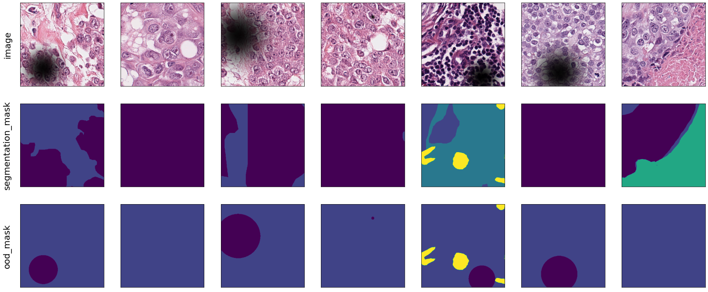
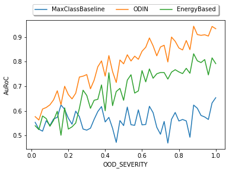
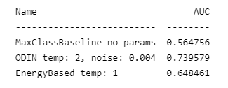

# FrOoDo - Framework for Out of Distribution Detection

## Introduction

This framework is made to tackle the problems of out of distrubtion data in digital pathology. During the data aquisition process different types of out of distribution data can occur e.g. artifacts like fat drops or unfocssed parts of the whole slide image. These ood data lower the segmentation metrics like the dice score in a critical way and it is therefore necessary to identify and remove ood data for the automatic segmentation with neural networks.

## Installation

The framework is designed to provide a quick and easy possibility to test new OOD methods, evaluate a model or design new augmentations. Therefore for most cases you wont need to modify ypur dataset or model to use this framework.

```
git clone https://github.com/JonathanSti/froodo
cd froodo
pip install -r requirements.txt
```

## Demo

### Code
```python
from froodo.quickstart import *

# init network
net = SegmentationModel().load()

# create dataset adapter
adapter = ...

# choose metrics
metrics = [
    OODAuRoC(bin_by='OOD_SEVERITY', num_bins=50),
    OODAuRoC(),
]

# choose post-hoc OOD methods
methods = [MaxClassBaseline(), ODIN(), EnergyBased()]

# create experiment component
experiment = AugmentationOODEvaluationComponent(
    data_adapter=adapter,
    augmentation=SampledAugmentation(DarkSpotsAugmentation()),
    model=net,
    metrics=metrics,
    methods=methods,
    seed=4321,
)

# run experiment
experiment()
```
### Output

The output of en experiment will be a sample of the evaluation data so see the correct augmentaion and the chose isualized metrics.

 

OODAuRoC(bin_by='OOD_SEVERITY', num_bins=50) | OODAuRoC()
:--: | :--:
 |  


## Manual


Explanation | Link
-- | :--:
Create new **Post-hoc OOD methods** | [here](docs/NEW_METHOD.md)
Create new **metrics** for your experiments | [here](docs/NEW_METRIC.md)
Create new **augmentation** for your dataset| tbd
Dataset Adaptation | tbd
How does the framework works internally?| tbd

## References


