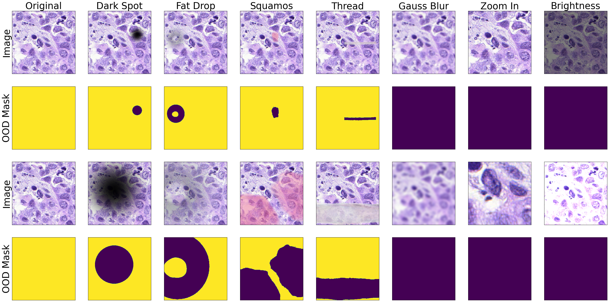
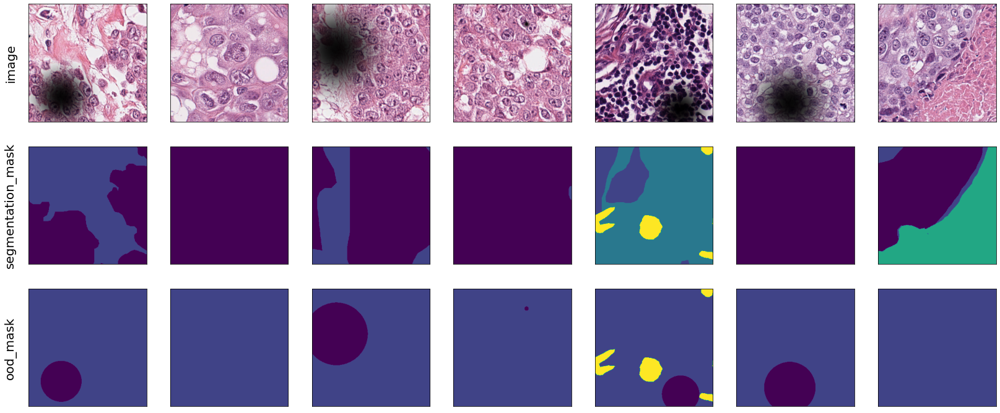
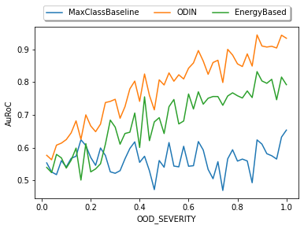
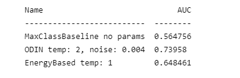

# FrOoDo - Framework for Out of Distribution Detection

 

## Introduction

This framework is made to tackle the problems of out of distrubtion data in digital pathology. During the data aquisition process different types of out of distribution data can occur e.g. artifacts like fat drops or unfocssed parts of the whole slide image. These ood data lower the segmentation metrics like the dice score in a critical way and it is therefore necessary to identify and remove ood data for the automatic segmentation with neural networks.

 

## Installation

The framework is designed to provide a quick and easy possibility to test new OOD methods, evaluate a model or design new augmentations. Therefore for most cases you wont need to modify ypur dataset or model to use this framework.

```
git clone https://github.com/JonathanSti/froodo
cd froodo
pip install -r requirements.txt
```

## Demo

This demo shows a typical ood evaluation scenario. A pathology dataset (in this case the BCSS dataset [1] ) is augmented with dark black spots which are marked as ood pixels. The images are then fed into a neual network and and ood score is comoputed with well known post-hoc ood methods. 

These scores are used by the AuRoc Metrics to calculate the seperability of in and ood data. Because of the augmentation there is information about the percentage of ood pixels in an image and the scores can therefore be calculated for different numbers of percentages.

You can find this demo [here](demo.ipynb).

### Code
```python
from froodo.quickstart import *

# init network
net = SegmentationModel().load()

# create dataset adapter
adapter = ...

# choose metrics
metrics = [
    OODAuRoC(bin_by='OOD_SEVERITY', num_bins=50),
    OODAuRoC(),
]

# choose post-hoc OOD methods
methods = [MaxClassBaseline(), ODIN(), EnergyBased()]

# create experiment component
experiment = AugmentationOODEvaluationComponent(
    data_adapter=adapter,
    augmentation=SampledAugmentation(DarkSpotsAugmentation()),
    model=net,
    metrics=metrics,
    methods=methods,
    seed=4321,
)

# run experiment
experiment()
```
### Output

The output of en experiment will be a sample of the evaluation data so see the correct augmentaion and the chosen visualized metrics.

 

OODAuRoC(bin_by='OOD_SEVERITY', num_bins=50) | OODAuRoC()
:--: | :--:
 |  


## Manual

The main advantage of froodo is that it can be extend easily because of clear defined interfaces. The manual pages describe how to e.g. add an augmentation or new ood method. 


Title | Explaination|  Link
-- | :-- | :--:
 Create new **Post-hoc OOD methods** | Learn how to implement your own post-hoc ood methods and how to evaluate it on your datasets |  [here](docs/NEW_METHOD.md)
Create new **metrics** for your experiments |  | [here](docs/NEW_METRIC.md)
Create new **augmentation** for your dataset| | tbd
Dataset Adaptation | The frameworks uses an object "Sample" to process the input. Therefore your dataset needs to be adapted to this standard. Learn how to use the default adapters or how tpo create an own adapter for a more complex dataset | tbd
How does the framework works internally?|  | tbd

## Future Work

- Integrated methods
- Experiment tracking
- More augmentations, more models, more methods, more ...

## References
[1] Amgad, M., Elfandy, H., Hussein, H., Atteya, L.A., Elsebaie, M.A., Abo Elnasr,
L.S., Sakr, R.A., Salem, H.S., Ismail, A.F., Saad, A.M., et al.: Structured crowd-
sourcing enables convolutional segmentation of histology images. Bioinformatics
(2019)

[2] Liu, W., Wang, X., Owens, J., Li, Y.: Energy-based out-of-distribution detection.
Advances in Neural Information Processing Systems (2020)

[3] Liang, S., Li, Y., Srikant, R.: Enhancing the reliability of out-of-distribution image
detection in neural networks. In: International Conference on Learning Represen-
tations (2018)

[4] Schömig-Markiefka, B., Pryalukhin, A., Hulla, W., Bychkov, A., Fukuoka, J., Mad-
abhushi, A., Achter, V., Nieroda, L., Büttner, R., Quaas, A., et al.: Quality control
stress test for deep learning-based diagnostic model in digital pathology. Modern
Pathology (2021)


